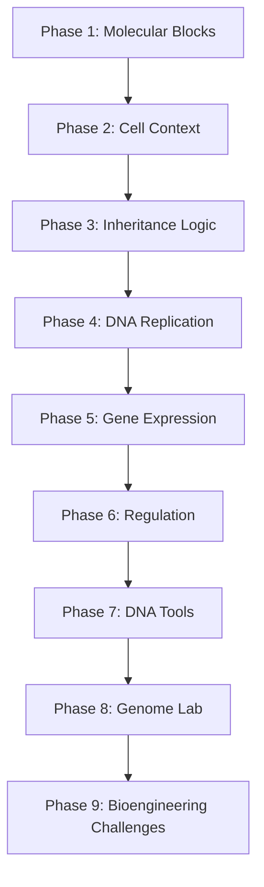

# play-bio

An iPad-native biology game that prepares an incoming UC Berkeley molecular biology freshman for the genetic-engineering arc of Campbell Biology by turning the hardest concepts into meaningful, satisfying, AI-informed puzzles and simulations.

## Why this game exists

Lelani is starting at Berkeley as a Molecular & Cell Biology major with an interest in genetic engineering. She already plays a lot of fast games on her iPad; Tetris is one example of the kind of short-session, repeatable play that can become habit-forming. The goal of this project is to redirect that gameplay reflex into something that builds durable mental models for the material she will see in her freshman biology courses, taken from [Campbell Biology, 12th edition](doc/campbell_biology_12e.md).

The game is not a flashcard app, not a quiz app, and not a textbook reader. It is a real game whose rules happen to be the rules of molecular biology. Every mechanic maps to a Campbell concept, and every level is gated by the prerequisites needed to understand the next one. The deeper goal is to help Lelani try on the identity of a molecular biologist and genetic engineer: someone who probes systems, forms hypotheses, tests interventions, and learns from the result.

## Why Expo + React Native

Yes — React Native with Expo is the right call for this project:

- iPad-native feel: gestures, haptics, audio, orientation locking, safe-area handling, and tablet layout all work out of the box.
- Fast iteration: Expo Go on the iPad gives instant reload while we tune the game feel, which matters a lot for short-session puzzle and simulation play.
- Clean deployment path: start with Expo Go, then move to TestFlight via EAS Build when we want a standalone app.
- Single codebase: if we ever want to share with a friend on Android or run on iPhone, we are not rewriting.
- Escape hatches exist: if a specific game-loop or animation needs raw performance, React Native New Architecture, Reanimated, Skia, and a custom native module are all available — we are not locked into JS-only rendering.

We are explicitly not starting in raw Swift/SpriteKit because the educational content will iterate far more often than the rendering pipeline, and JS-driven content updates are much faster.

## Source material

The single source of truth for biology content is [doc/campbell_biology_12e.md](doc/campbell_biology_12e.md), an export of Campbell Biology, 12th edition (Urry et al., Pearson). Every concept the game teaches must be traceable back to a specific chapter and concept in that book.

The first source for game AI and interaction design is [doc/Artificial Intelligence for Games.md](doc/Artificial%20Intelligence%20for%20Games.md) by Ian Millington. The key lesson for this project is not "make everything complex." It is that good game AI is a practical mix of movement, decision-making, strategy, and infrastructure, often using simple systems that look smart inside the player's perception window. That maps well to a biology game: molecular agents, repair systems, cell compartments, lab tools, and adaptive tutorials can all be modeled with small, understandable AI systems.

The first source for game design fundamentals is [doc/game-design-fundamentals.md](doc/game-design-fundamentals.md), a text dump of Salen and Zimmerman's *Rules of Play: Game Design Fundamentals*. The most important lesson is meaningful play: player actions must have discernable outcomes and integrated consequences. For this game, that means every tap, drag, route, repair, cut, or edit should visibly change the biological system and matter to the level outcome.

The first source for game tuning and structural analysis is [doc/characteristics of games.md](doc/characteristics%20of%20games.md), Richard Garfield, Skaff Elias, and K. Robert Gutschera's *Characteristics of Games*. The most useful lens for this project is that fun depends on tunable characteristics: session length, rule burden, goals, feedback, luck/skill mix, hidden information, snowball/catch-up, downtime, busywork, reward/effort ratio, and whether the real decision tree collapses to one dominant tactic.

The first source for learning design is [doc/What-Video-Games-Have-to-Teach-us.md](doc/What-Video-Games-Have-to-Teach-us.md), James Paul Gee's *What Video Games Have to Teach Us About Learning and Literacy*. The key lesson is that good games teach by inducting players into a semiotic domain: a world of signs, tools, actions, identities, and practices. Biology terms like codon, primer, ligase, vector, and expression should gain meaning through use inside problems, not through definitions alone.

The first source for design craft is [doc/the-art-of-game-design.md](doc/the-art-of-game-design.md), Jesse Schell's *The Art of Game Design: A Book of Lenses*. The useful takeaway is to evaluate the game through repeatable lenses: essential experience, player empathy, theme, mechanics, aesthetics, interface, puzzles, flow, interest curves, balance, and playtesting. For this project, every feature should answer: does this help Lelani feel like she is understanding and intervening in living molecular systems?

### Most relevant Campbell sections for genetic engineering

Mapped from the book's `## CONCEPT` headings:

- Prerequisite foundations
  - Ch 5 — Macromolecules
    - 5.4 Proteins: structure → function
    - 5.5 Nucleic acids store, transmit, and help express hereditary information
    - 5.6 Genomics and proteomics have transformed biological inquiry
  - Ch 6 — The Cell
    - 6.3 Genetic instructions live in the nucleus and are carried out by ribosomes
    - 6.4 Endomembrane system / protein traffic
  - Ch 12 — The Cell Cycle (mitosis, cell-cycle control system)
- Transmission genetics
  - Ch 13 Meiosis and Sexual Life Cycles (13.1–13.4)
  - Ch 14 Mendel and the Gene Idea (14.1–14.4)
  - Ch 15 The Chromosomal Basis of Inheritance (15.1–15.5: linkage, sex linkage, chromosomal disorders, exceptions)
- Molecular core
  - Ch 16 The Molecular Basis of Inheritance
    - 16.1 DNA is the genetic material
    - 16.2 Replication and repair
    - 16.3 Chromosome packaging
  - Ch 17 Gene Expression: From Gene to Protein
    - 17.1 Genes specify proteins via transcription and translation
    - 17.2 Transcription
    - 17.3 RNA processing in eukaryotes
    - 17.4 Translation
    - 17.5 Mutations + CRISPR used to correct disease-causing mutations
- Regulation
  - Ch 18 Regulation of Gene Expression
    - 18.1 Bacterial operons
    - 18.2 Eukaryotic regulation at many stages
    - 18.3 Noncoding RNAs
    - 18.4 Differential gene expression → cell types
    - 18.5 Cancer as broken cell-cycle control
- Engineering toolkit
  - Ch 19 Viruses (vectors, life cycles, pathogens)
  - Ch 20 DNA Tools and Biotechnology
    - 20.1 DNA sequencing, DNA cloning, restriction enzymes, recombinant plasmids
    - 20.2 Studying gene expression and function
    - 20.3 Cloning organisms, stem cells
    - 20.4 Practical applications: medical, forensic, environmental, agricultural, ethics
- Genome-scale thinking
  - Ch 21 Genomes and Their Evolution
    - 21.1 Sequencing techniques (Human Genome Project lineage)
    - 21.2 Bioinformatics
    - 21.3 Genome size, gene number, gene density
    - 21.4 Noncoding DNA, multigene families
    - 21.5 Duplication, rearrangement, mutation → genome evolution
    - 21.6 Comparative genomics and evo-devo
- Applied extension
  - Ch 38.3 People modify crops by breeding and genetic engineering

### Concepts most likely to be hard for a freshman

These are the sections we assume are "hard" and design extra game time around:

1. Ch 17 — coupling transcription, RNA processing, the genetic code, ribosome mechanics, and mutation consequences in one mental model.
2. Ch 18 — many regulatory layers (chromatin, TFs, ncRNA, developmental programs) that only make sense after Ch 17.
3. Ch 16 — replication geometry (leading vs lagging, primers, repair, telomeres) and its biochemical machinery.
4. Ch 20 — high procedural load: many named methods (cloning, PCR, sequencing, CRISPR) easily blur together without practice.
5. Ch 21 — interpretation at genome scale, including noncoding DNA and gene families, which requires comfort with evolution.
6. Ch 13 vs Ch 12 — meiosis vs mitosis is a classic stumbling block before linkage in Ch 15.

## Game concept

A fast iPad game made of short, replayable biology challenges. Some levels may borrow from Tetris-like falling-block play, but that is only one inspiration. Each biology topic should get the game form that teaches it best: snap puzzles, routing challenges, repair races, pipeline debugging, tactical lab planning, agent simulations, or turn-based engineering scenarios.

The essential experience: the player feels like a young molecular biologist using real conceptual tools to probe, repair, express, regulate, and engineer living systems. The game should trim simulation detail whenever that detail does not serve this experience.

The theme: biology is programmable, but never arbitrary. Every action has consequences because living systems are rule-governed, interconnected, and ethically loaded.

The player clears biological objectives, not generic rows or trivia prompts:

- Pair bases into a stable DNA strand.
- Repair replication errors before the polymerase moves on.
- Transcribe DNA into mRNA without frameshifts.
- Assemble codons into a working protein.
- Tune gene-expression switches to make the right cell type.
- Cut, paste, and ligate plasmids to clone a target gene.
- Pick the right vector, primer, or guide RNA for a job.
- Read genome data and make a bioengineering decision.

Design principles:

- Short rounds suitable for handheld iPad play (2–5 minutes per board).
- Touch-first interactions: drag, rotate, trace, connect, route, tune, cut, ligate, sequence, and debug.
- Biology rules drive scoring — the game cannot be won by pattern-matching alone.
- Each level introduces exactly one new biological rule, then recombines it with prior rules.
- Every meaningful action has readable feedback now and consequences later.
- Every level has goals within goals: a moment-to-moment action, a level objective, a topic mastery goal, and a visible path toward the broader genetic-engineering arc.
- Keep first-order rules tiny: teach only what the player needs to act now, then introduce second-order biology edge cases only when they matter.
- Randomness and hidden information are allowed for variety and discovery, but the player must be able to tell whether failure came from bad biology, bad timing, or bad luck.
- Learning happens through a probe cycle: try an intervention, observe the biological response, form a better hypothesis, and try again.
- Information should be explicit on-demand and just-in-time. Do not front-load textbook explanations before the player has a reason to care.
- Later levels should force transfer: skills from replication, expression, and regulation must recombine in new contexts, not stay isolated as mini-games.
- The interface must make the player feel in control: the expected gesture should map cleanly to the biological consequence.
- Each round should have an interest curve: quick hook, mid-round complication, and satisfying payoff or teachable failure.
- Mistakes are first-class feedback: mismatch, frameshift, failed expression, off-target edit, broken plasmid, unreadable read.
- One-sentence biology explanations on failure — never a wall of text.
- Native iPad feel: gestures, haptics, sound, landscape-first layout.

## Game design fundamentals

Ideas from [Rules of Play](doc/game-design-fundamentals.md) should shape the product as much as the curriculum:

- Meaningful play: every player action must be both discernable (the player can tell what happened) and integrated (the consequence matters to the system, score, level state, or future choice).
- Core loop: observe a biological system, choose an intervention, apply it through touch, see the system respond, then use that feedback to make the next decision.
- Feedback systems: use negative feedback to stabilize frustration when the player is struggling, and positive feedback to amplify mastery when the player is making strong choices. Do not use invisible rubber-banding that makes success feel fake.
- Flow: boredom means the choices are too obvious or disconnected; anxiety means the player lacks control or readable feedback. Playtests should diagnose which failure mode is happening.
- Rewards: mix glory (badges, clean clears), sustenance (extra time, repair tools), access (new topics and labs), and facility (new actions such as ligase, primers, vectors, or guide RNA).
- Onboarding: teach by rewarded action, not by long instructions. The first version of every mechanic should be playable with almost no reading.
- Simulation: model the parts of biology that matter for learning and fun. The simulation should be pedagogically truthful, not exhaustively realistic.
- Homework avoidance: the game should feel like solving living systems, not answering worksheets. Terminology earns its place only when it helps the player act.

## Game characteristics

Ideas from [Characteristics of Games](doc/characteristics%20of%20games.md) should shape tuning and balance:

- Session length: design for a clear 2–5 minute round, with a natural stopping point after each level and a larger topic milestone after a short cluster.
- Rule burden: separate first-order rules (what must be known to play this level) from second-order rules (edge cases, exceptions, deeper Campbell details). The former must be tiny; the latter can unlock later.
- Goal chunking: avoid relying on raw numeric score alone. Use visible chunks such as clean clear, three-star mastery, concept mastered, lab unlocked, and phase complete.
- Luck vs skill: randomness can add variety, soften failure, and support catch-up, but it must not make learning attribution muddy. If a mutation, contaminant, or read error is random, label it as such after the round.
- Hidden information: unknown sequence damage, mystery samples, and partial genome reads can be fun, but static mysteries do not replay well. Prefer regenerated cases when using hidden information.
- Snowball and catch-up: do not let early mistakes create a long hopeless run. Either end quickly with useful feedback or offer catch-up tools that preserve biological logic.
- Balance and strategic collapse: no lab tool should solve every problem. Enzymes, primers, vectors, guide RNAs, repair tools, and hints should each be situationally best.
- Pacing arc: levels should move from sparse setup, to bushy choice space, to focused resolution. Avoid starting every level at maximum complexity.
- Busywork: rote calculation, repeated labeling, and long drag chores are design smells unless they produce immediate mastery feedback.
- Reward/effort ratio: every effortful action should pay off with progress, insight, delight, or a new tactical option.

## Learning principles

Ideas from [What Video Games Have to Teach Us](doc/What-Video-Games-Have-to-Teach-us.md) should shape the educational design:

- Semiotic domain: the game should make molecular biology feel like a practice with tools, signs, norms, and actions, not a vocabulary list.
- Projective identity: the player should feel like a developing biologist/engineer whose choices express a scientific style: careful, bold, efficient, ethical, experimental.
- Psychosocial moratorium: failure should be safe and low-cost. A bad edit or failed plasmid is information, not punishment.
- Probe/hypothesize/reprobe/rethink: each level should invite experimentation with clear consequences, then require the player to revise their model.
- Situated meaning: terms gain meaning in context. A "primer" matters because the replication/PCR system will not proceed without the right one.
- Subset and incremental learning: early levels are simplified subdomains; complexity expands only after the player has a playable model.
- Regime of competence: the best levels sit at the edge of the player's ability: challenging enough to stretch, readable enough to continue.
- Multiple routes: advanced scenarios should allow more than one valid path when biology permits it, such as alternate cloning strategies or different diagnostic workflows.
- Transfer: later phases should deliberately remix earlier skills so the player learns flexible biological reasoning rather than memorized procedures.
- Affinity and insider stance: future sharing/community features should be about practice and discovery, not generic leaderboards.

## Schell design lenses

Ideas from [The Art of Game Design](doc/the-art-of-game-design.md) should be used as design QA questions:

- Essential experience: what should the player feel, and what details can be removed because they do not serve that feeling?
- Player lens: design for Lelani specifically, then validate by watching her play. Her actual behavior beats our assumptions.
- Elemental tetrad: technology, mechanics, story, and aesthetics must reinforce each other. Expo/iPad is the technology; Campbell biology is the mechanics; the story is becoming a capable young bioengineer; the aesthetics should make molecular systems readable and beautiful.
- Unification and resonance: every major feature should echo the theme that living systems are understandable, manipulable, and consequential.
- Curiosity and surprise: each arc should put a question in the player's mind, such as "what happens if this primer binds in the wrong place?" or "why did expression fail?"
- Problem solving: the game should generate fresh biological problems, not just ask the same question with new labels.
- Puzzle quality: goals must be clear, starts must be easy, progress must be visible, difficulty must ramp gradually, hints must extend interest, and the answer should be available when stuck.
- Control and juiciness: gestures should feel powerful, responsive, and biologically meaningful. A good ligation, splice, or repair should feel good in the hand.
- Interest curves: tune each 2–5 minute round and each phase cluster for hook, rising complication, rest, and payoff.
- Aesthetics: visual and audio design are not decoration; they carry information and make molecular systems memorable.
- Playtesting: every prototype should answer a named question. Rough prototypes are fine if they reveal whether the experience works.

## AI-informed design

Ideas from [Artificial Intelligence for Games](doc/Artificial%20Intelligence%20for%20Games.md) should shape the game architecture and level design:

- Decision systems: use state machines, decision trees, and rule systems for predictable level behavior, tutorial flow, and biology constraints. These are easier to author and debug than opaque black-box models.
- Blackboard-style level state: keep shared facts about the current board, such as active mutations, available enzymes, gene-expression state, hint history, and mastery signals.
- Tactical analysis: use influence maps, cost functions, and pathfinding for levels about intracellular transport, vector delivery, viral spread, repair enzymes, and genome search.
- Goal-oriented behavior: model molecular agents or lab assistants as systems pursuing biological goals, such as "repair mismatch," "deliver mRNA," or "express protein."
- Adaptive difficulty: maintain a lightweight player model tracking mastery, speed, error type, hint use, and repeated misconceptions. Use it to tune challenge and surface review, not to punish the player.
- Scheduling and level of detail: keep the iPad responsive when several agents or simulations are active by updating only what matters at the current moment.
- Data-driven tooling: Campbell concepts, mechanics, misconceptions, objectives, hints, and level parameters should live in editable content files, not be hard-coded into the engine.

## Learning progression

Phases are sequenced so that no level depends on a concept the player has not yet earned. The player must demonstrate mastery of each phase's core mechanic before the next phase unlocks.

The UX progression should be more than a chapter list. Each phase should contain nested goals:

- Moment: make one correct move (pair a base, route an RNA, select an enzyme).
- Level: solve one biological problem under clear constraints.
- Cluster: master one Campbell concept through several variations.
- Arc: unlock a new kind of biological agency, such as replication, expression, regulation, or engineering.

Progress should be chunked into visible achievements rather than a single score stream. A good cluster might be: learn the move, solve a basic board, solve a variant with a twist, earn a clean clear, then unlock the next biological tool.

Each phase should also support transfer. A player who learned base pairing in Phase 1 should use it again in replication, transcription, PCR primer design, CRISPR guide matching, and genome interpretation, with the game making the recurring idea visible.

### Phase 1 — Molecular Blocks

Campbell Ch 5 (5.4–5.6).
Identify nucleotides (A, T, G, C, U), recognize amino acids vs nucleotides, snap complementary base pairs, distinguish DNA vs RNA. Possible game forms: snap puzzles, quick sorting, rhythm/timing pair matches.

### Phase 2 — Cell Context

Campbell Ch 6 (6.3–6.4).
Sort molecular events into the right cellular compartment: DNA stays in the nucleus (eukaryote), ribosomes translate in the cytoplasm or rough ER, secreted proteins go through the endomembrane system. Possible game forms: route planning, compartment navigation, intracellular delivery.

### Phase 3 — Inheritance Logic

Campbell Ch 12, 13, 14, 15.
Mitosis vs meiosis as a sorting puzzle (chromosome counts, when crossover happens). Mendelian crosses as quick combo rounds. Linkage and sex linkage as pattern modifiers. Possible game forms: turn-based chromosome sorting, probability board puzzles, family-line simulations.

### Phase 4 — DNA Replication

Campbell Ch 16.
Build replication forks: place primers, run leading vs lagging strands, manage Okazaki fragments, catch mismatches before proofreading is too late, deal with telomere shortening at the ends. Possible game forms: repair races, enzyme-agent scheduling, strand-construction puzzles.

### Phase 5 — Gene Expression

Campbell Ch 17.
Transcribe DNA → pre-mRNA, splice out introns, add 5' cap and poly-A tail, then translate codon-by-codon at the ribosome. Point mutations cause silent / missense / nonsense outcomes that score differently. Possible game forms: pipeline debugging, codon assembly, frameshift recovery, ribosome timing challenges. This phase is the deepest milestone of the MVP.

### Phase 6 — Regulation

Campbell Ch 18.
Configure operons (lac, trp) as switches. In eukaryotes, tune chromatin state, transcription factors, enhancers, and miRNA gates so the right cell type is produced. Cancer levels: the cell cycle goes off the rails when checkpoints are bypassed. Possible game forms: switchboard control, fuzzy thresholds, state-machine debugging, runaway-cell containment.

### Phase 7 — DNA Tools

Campbell Ch 19, Ch 20.
Cut DNA with the right restriction enzymes, ligate fragments into plasmids, pick the right viral or bacterial vector, run PCR with correct primers, run a sequencing read, and use CRISPR/Cas9 to make a targeted edit. Possible game forms: lab workflow planning, cut-and-ligate puzzles, guide RNA targeting, contamination avoidance.

### Phase 8 — Genome Lab

Campbell Ch 21.
Annotate genomes: spot coding regions, recognize multigene families, identify transposable elements, decide which differences between genomes are likely meaningful. Possible game forms: search/pathfinding over sequence space, pattern detection, evidence-weighting puzzles.

### Phase 9 — Bioengineering Challenges

Campbell Ch 20.4, Ch 38.3, with CRISPR ethics from Ch 17.5 / Ch 20.
Applied scenarios that recombine every prior mechanic:

- Engineer bacteria to produce human insulin.
- Correct a sickle-cell-causing mutation with CRISPR.
- Build a transgenic crop (Golden Rice style) without breaking off-target genes.
- Generate a forensic DNA profile from a degraded sample.
- Use microbes to clean up an environmental contaminant.
- Make ethics calls — some "winning" plays should cost the player ethics points and unlock a debrief.

Possible game forms: multi-step strategy scenarios, resource constraints, risk/reward tradeoffs, and ethical decision consequences.

## High-level requirements

- Platform: iPad-first React Native + Expo app, landscape orientation preferred, responsive across iPad mini → iPad Pro 13".
- Audience: incoming biology freshman familiar with fast puzzle games, who needs durable mental models before coursework starts.
- Gameplay: a library of short game forms rather than one universal mechanic; optional relaxed/untimed mode for studying; streaks, combos, level goals, skill unlocks, replayable challenge boards.
- Meaningful play: every core action must have discernable feedback and integrated consequences. If an interaction does not change the system in a way the player can understand, it should be cut or redesigned.
- Rules: distinguish first-order rules from second-order biology. First-order rules must be immediately playable; second-order detail unlocks only when the player has a reason to care.
- Pedagogy: every new mechanic maps to a specific Campbell concept reference. Quizzes are embedded as in-game decisions, not separate flashcards.
- Feedback: wrong moves explain the biology consequence in one sentence and offer immediate retry. No "game over" without a learning moment.
- Learning loop: levels are built around probe, hypothesize, reprobe, rethink. The player should learn by acting in the system and interpreting its response.
- Situated language: terminology appears after or during use. Text should name the thing the player is already manipulating.
- Essential experience: remove or simplify features that do not help the player feel like she is probing and engineering molecular systems.
- Tetrad fit: technology, mechanics, story, and aesthetics must be reviewed together for each major level form.
- Interface/control: touch gestures must map predictably to biological actions and provide immediate sensory confirmation.
- Puzzle design: each puzzle must have a clear goal, easy start, visible progress, gradual difficulty ramp, and useful hints.
- Progression: levels gated by prerequisite concepts. Mastery checks (e.g., 3 clean clears) required before harder genetic-engineering mechanics unlock.
- Onboarding: first-time mechanics are introduced through rewarded micro-actions before any explanatory text. Text supports play; it does not replace play.
- Luck and hidden information: use randomness and mystery for variety, catch-up, and discovery, but make failures attributable. The player should learn whether they made a biology error or encountered a stochastic event.
- Balance: playtest for strategic collapse. If one action, tool, or heuristic dominates an entire phase, redesign the level set or rebalance the tool.
- Pacing: minimize downtime and busywork. Short pauses for thinking are allowed; long stretches without meaningful decisions are not.
- Adaptive layer: track mastery, speed, error type, hint use, and repeated misconceptions locally, then use that model to tune hints and difficulty.
- Game AI architecture: use state machines/decision trees for predictable level behavior, rule systems for biology constraints, blackboards for shared level state, and scripted/tutorial actions where authored control matters.
- Content model: concepts, mechanics, misconceptions, and level objectives are data-driven (JSON/TS) so new Campbell topics can be added without rewriting the game loop.
- Balance and playtesting: watch for boredom, anxiety, opaque feedback, and homework-like grind. Tune rules from observed play, not from design documents alone.
- Mentor view: optional progress summary for parents/tutors showing concepts mastered, weak spots, and suggested Campbell sections to re-read.
- Accessibility: large readable iPad typography; colorblind-safe symbol set (do not rely on color alone for A/T/G/C); haptics and audio individually toggleable; pause-anywhere.
- Privacy: local-first progress by default. No account requirement for v1. No ads. No dark patterns. No leaderboards that pressure play time.
- Tech baseline: Expo SDK (latest stable), TypeScript, Reanimated for game animation, expo-haptics + expo-av for feel, Zustand or similar for game state, file-based content modules per phase.

## Suggested MVP scope

Build one polished, fun vertical slice before attempting the full nine phases.

- Ship Phases 1 → 5 only. The deepest first milestone is transcription / translation / mutation consequences (end of Phase 5 / Ch 17).
- Target ~20–30 levels across those five phases.
- Include 2–3 distinct level forms in the MVP: one fast puzzle, one spatial/route-planning challenge, and one pipeline/debugging challenge.
- Defer CRISPR, bioinformatics, regulation, and applied bioengineering until those early game forms are provably fun on a real iPad in Lelani's hands.
- Use placeholder art early; the mechanics must feel good before we invest in custom illustration.
- Lock in a data-driven level format from day one so adding levels does not require touching the engine.
- Build a playable prototype early, before the project becomes content-heavy. The first prototype should answer: is the action readable, is the feedback satisfying, and does Lelani voluntarily replay?
- Build the toy first: before polished content, prototype the core touch interaction that makes a biological process feel good.
- Playtest for flow: boredom, anxiety, confusion, and "this feels like homework" are explicit failure signals.
- Playtest for game-characteristic failures: too many rules up front, unclear luck vs skill, one dominant tactic, long hopeless runs after early errors, excessive downtime, and low reward for effort.
- Playtest for learning failures: definitions appearing before need, mistakes that do not teach, skills that do not transfer, and levels that feel like school exercises instead of scientific experimentation.
- Playtest for Schell-lens failures: weak essential experience, muddy theme, poor control feel, flat interest curve, unclear puzzle goal, and aesthetics that obscure rather than clarify.
- Definition of done for MVP: Lelani plays it voluntarily, beats Phase 5 without coaching, and can correctly explain transcription → translation → a frameshift mutation afterwards.

## Future expansion ideas

- Phases 6–9 (regulation, DNA tools, genome lab, bioengineering challenges).
- Daily challenge boards generated from real Campbell figures.
- "Lab notebook" view that shows which Campbell concepts the player has mastered, with direct page references back into [doc/campbell_biology_12e.md](doc/campbell_biology_12e.md).
- Co-op / pass-the-iPad mode for study groups.
- Optional affinity features: share weird mutations, elegant solutions, custom challenge seeds, or lab-notebook discoveries with friends.
- Optional cloud sync once a single-user version is loved.
- Companion exam-prep modes timed to UC Berkeley MCB course schedules.
- Expanded content: immune system (Ch 43), evolution (Ch 22–25), and signaling (Ch 11) once the genetic-engineering spine is solid.
- Additional design passes from the next game theory/game design books in [doc](doc), ingested one at a time.

## Repository status

This repo is currently a blank slate with source material in [doc](doc): [Campbell Biology](doc/campbell_biology_12e.md) for curriculum, [Artificial Intelligence for Games](doc/Artificial%20Intelligence%20for%20Games.md) for the first pass at game AI/design architecture, [Rules of Play: Game Design Fundamentals](doc/game-design-fundamentals.md) for meaningful play, feedback, progression, rewards, and playtesting, [Characteristics of Games](doc/characteristics%20of%20games.md) for tuning rules, luck, skill, hidden information, pacing, balance, and reward/effort, [What Video Games Have to Teach Us](doc/What-Video-Games-Have-to-Teach-us.md) for situated learning, identity, safe failure, transfer, and just-in-time instruction, and [The Art of Game Design](doc/the-art-of-game-design.md) for design lenses, essential experience, theme, the elemental tetrad, interface, puzzles, interest curves, and playtesting. Next step after this README is approved is to scaffold the Expo app and the data-driven level format.